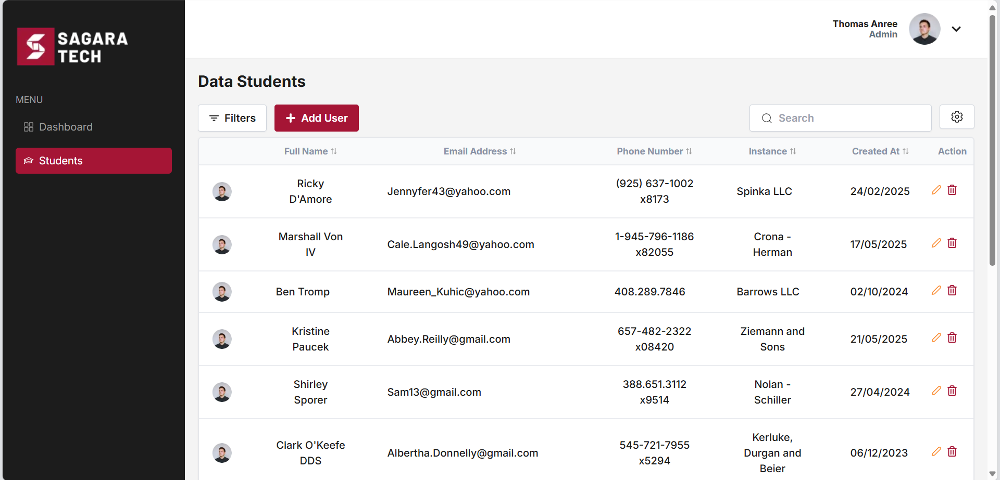

# Frontend MSIB Test

This is a frontend project built using Next.js and Tailwind CSS.

## How to Run

### Option 1: Run Locally

1. **Clone the repository**:
    ```bash
    git clone https://github.com/febryanarota/frontend-dev-sagara
    cd frontend-dev-sagara
    ```

2. **Install dependencies**:
    ```bash
    npm install
    ```

3. **Start the development server**:
    ```bash
    npm run dev
    ```

4. **Open your browser** and navigate to:
    ```
    http://localhost:3000
    ```

### Option 2: View Live Demo

You can also view the live demo of this project on Vercel:

- **Live Demo**: [Vercel](https://frontend-dev-sagara.vercel.app/)

## Stack Used

- **Next.js**: React framework for building server-side rendering and static web applications.
- **Tailwind CSS**: A utility-first CSS framework for rapid UI development.

## Pages

### Home Page


### Dashboard

route: /dashboard
  


### Students
route: /students

